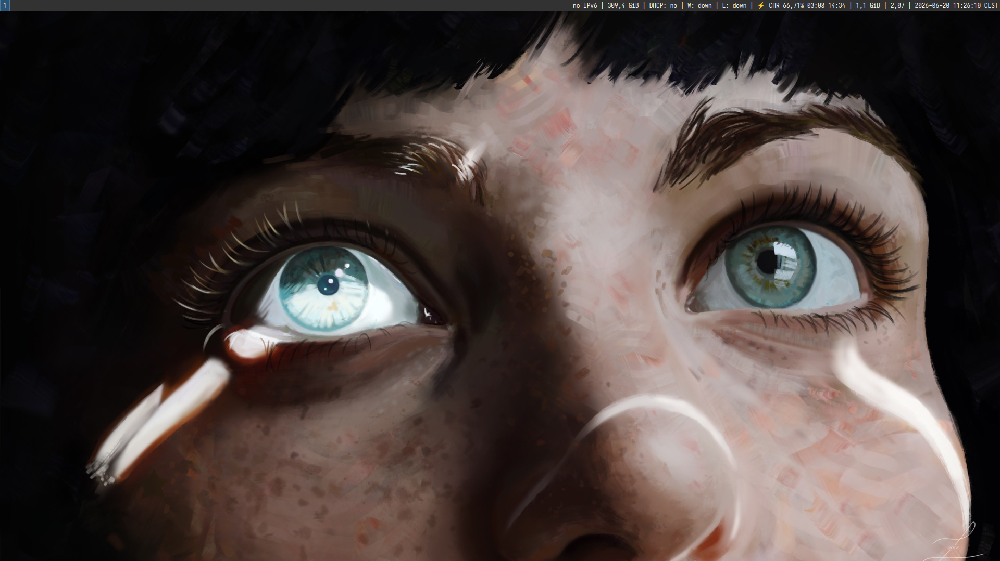

#+title:     Dotfiles Setup
#+author:    bvtuhan
#+email:     jjackson.stormm@gmail.com

My chezmoi-managed =dotfiles= for a minimal =Sway/Wayland= environment
using =Emacs=, and =fish=.

#+CAPTION: Desktop Overview
#+NAME:   fig:screenshot-desktop

** Setup

*** Install =chezmoi=

Via curl:
#+begin_src bash
sh -c "$(curl -fsLS get.chezmoi.io)"
#+end_src

Or via package manager:
#+begin_src bash
sudo pacman -S chezmoi
#+end_src

*** Clone the repo

#+begin_src bash
chezmoi init https://github.com/bvtuhan/dotfiles.git
chezmoi apply
#+end_src

*** Pull the latest changes

#+begin_src bash
chezmoi update
#+end_src

*** Add custom changes

#+BEGIN_SRC bash
chezmoi add ~/.emacs.d/init.el
# or use re-add
chezmoi re-add
#+END_SRC

** Install Font

For terminal, I use [[https://www.nerdfonts.com/font-downloads][Iosevka-Term-Nerd-Font]].
#+BEGIN_SRC bash
sudo mkdir -p /usr/local/share/fonts
unzip -j IosevkaTerm.zip '*.ttf' -d /usr/local/share/fonts/
fc-cache -fv
#+END_SRC

However for my daily use, i prefer the normal fixed version
[[https://github.com/be5invis/Iosevka/releases/tag/v34.8.0][PkgTTF-IosevkaFixed-34.8.0.zip]].
#+BEGIN_SRC bash
unzip -j PkgTTC-SGr-IosevkaFixed-34.8.0.zip '*.ttc' -d /usr/local/share/fonts/
fc-cache -fv
#+END_SRC

** Wayland Stuff

#+BEGIN_SRC bash
sudo pacman -S i3status # for status bar
sudo pacman -S swaybg # for background
sudo pacman -S grim wl-clipboard slurp # for screenshot
sudo pacman -S wdisplays # display adjuster
sudo pacman -S pavucontrol # voice control
#+END_SRC

** Virtualization Setup

#+BEGIN_SRC bash
sudo pacman -S --needed \
  qemu \
  libvirt \
  virt-manager \
  virt-viewer \
  dnsmasq \
  vde2 \
  ebtables \
  iptables-nft \
  dmidecode \
  ovmf \
  edk2-ovmf \
  swtpm \
  spice-gtk \
  spice-protocol \
  usbredir

sudo systemctl enable --now libvirtd.service
sudo usermod -aG libvirt $(whoami)
#+END_SRC
